# Car Booking System

<div align="center">

[](https://opensource.org/licenses/MIT)
[](https://www.postgresql.org/)
[](https://nodejs.org/)
[](https://www.docker.com/)

**A modern car rental management system with web interface**

[Installation](#installation) • [Features](#features) • [Documentation](#api-documentation) • [Contributing](#contributing)

</div>

---

A comprehensive SQL solution for car hire companies to manage vehicle bookings, customer data, and rental operations. Features a modern web interface for easy management and real-time availability tracking.

### Quick Start

```bash
git clone https://github.com/AL-Kaisi/CarBookingSystem.git
cd CarBookingSystem
docker-compose up -d
```

Access the system at: http://localhost:3000

## Table of Contents

- [Overview](#overview)
- [Screenshots](#screenshots)
- [Features](#features)
- [System Architecture](#system-architecture)
- [Database Schema](#database-schema)
- [Installation](#installation)
- [Usage](#usage)
- [API Documentation](#api-documentation)
- [Technology Stack](#technology-stack)
- [Contributing](#contributing)
- [Licence](#licence)

## Overview

The Car Booking System is a complete car rental management solution built with PostgreSQL and Node.js. It provides both a powerful database backend and an intuitive web interface for managing customers, vehicles, bookings, and generating reports.

## Screenshots

### Dashboard
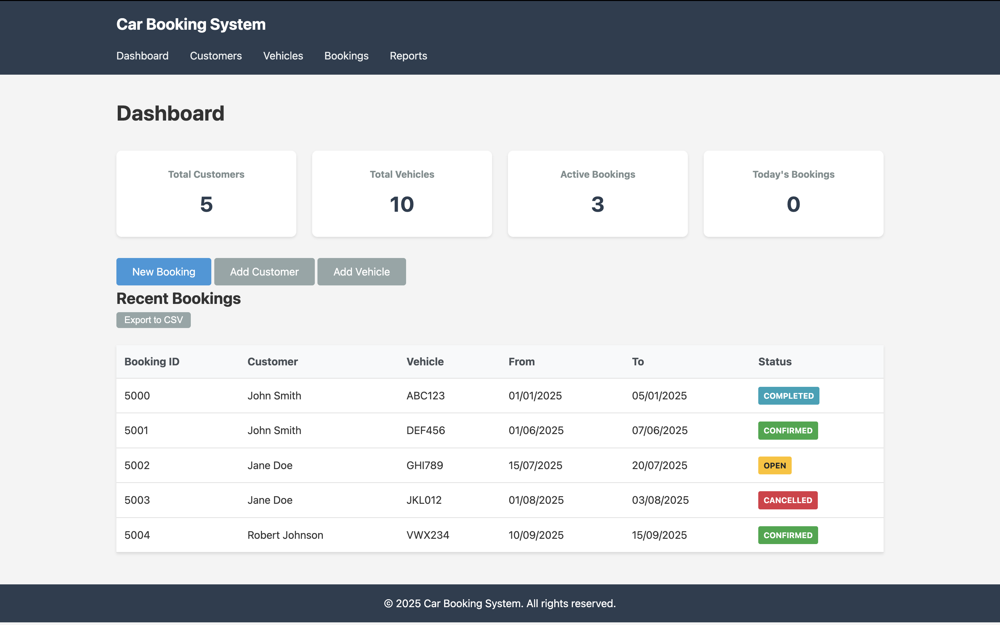
*Main dashboard showing system statistics and recent bookings*

### Customer Management
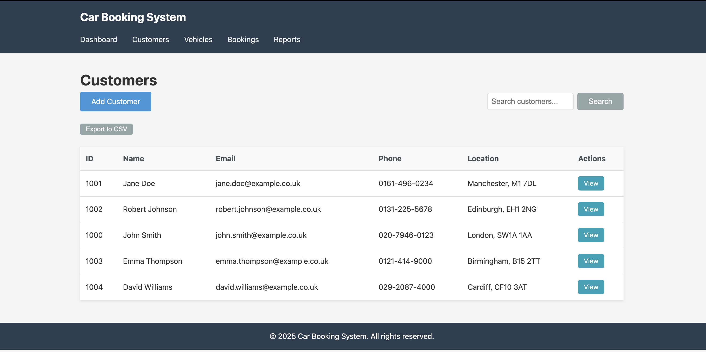
*Customer list with search functionality*

### Vehicle Management
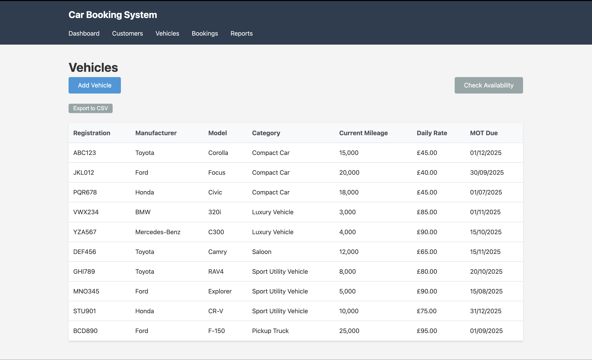
*Vehicle inventory and availability checking*

### Booking Process
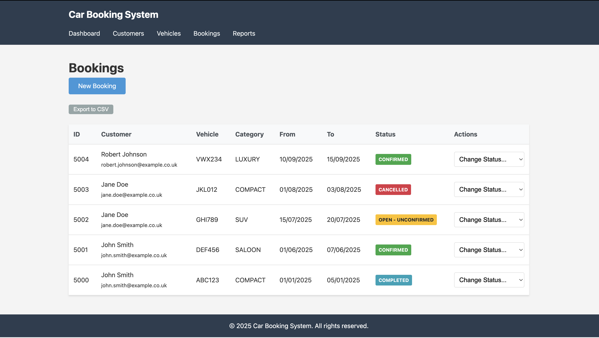
*Step-by-step booking creation with real-time availability*

### Reports

*Revenue reports with visual charts*

## Features

### Core Functionality
- **Customer Management**: Register, search, and track customer information
- **Vehicle Management**: Maintain fleet inventory with categories and pricing
- **Booking System**: Create, modify, and cancel reservations
- **Availability Checking**: Real-time vehicle availability verification
- **Reporting**: Generate revenue reports with visual analytics
- **Web Interface**: Modern browser-based management dashboard

### Technical Features
- **Modular Architecture**: Organised function structure for maintainability
- **Data Integrity**: Business rules enforced through triggers
- **Performance**: Optimised queries with strategic indexing
- **Security**: Input validation and parameterised queries
- **Containerisation**: Docker support for easy deployment
- **RESTful Design**: Clean API structure for extensibility

### Feature Comparison

| Feature | Car Booking System | Traditional Systems |
|---------|-------------------|-------------------|
| **Database** | PostgreSQL (Free) | Oracle (Licensed) |
| **Deployment** | Docker (1 command) | Manual setup |
| **Web Interface** | Included | Separate purchase |
| **API** | RESTful | Legacy |
| **Real-time Updates** | Yes | Limited |
| **Cost** | Free | Expensive |
| **Open Source** | Yes | No |
| **Scalability** | Horizontal | Limited |

### Key Metrics

| Metric | Value |
|--------|-------|
| **Setup Time** | < 5 minutes |
| **Database Tables** | 7 |
| **Core Functions** | 12 |
| **API Endpoints** | 8 |
| **Lines of Code** | ~3,000 |
| **Container Size** | < 500MB |
| **Memory Usage** | < 256MB |
| **Response Time** | < 100ms |

## System Architecture

### Component Architecture

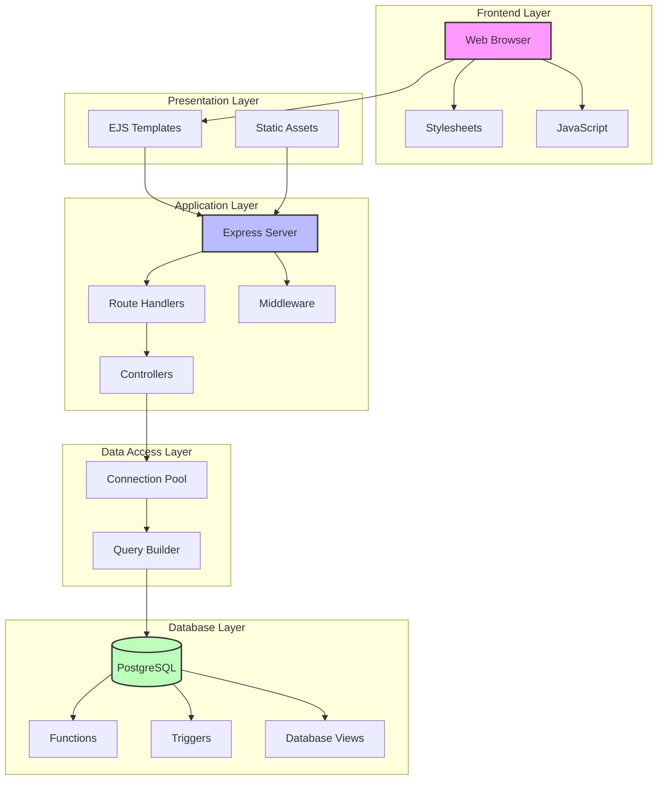

### Layered Architecture

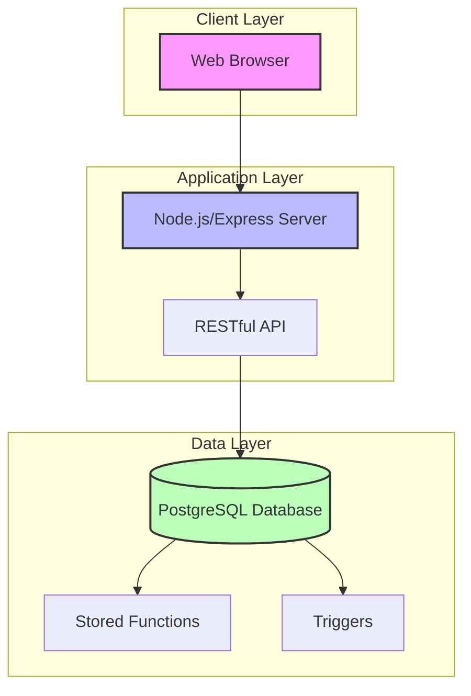

## Database Schema

### Class Diagram

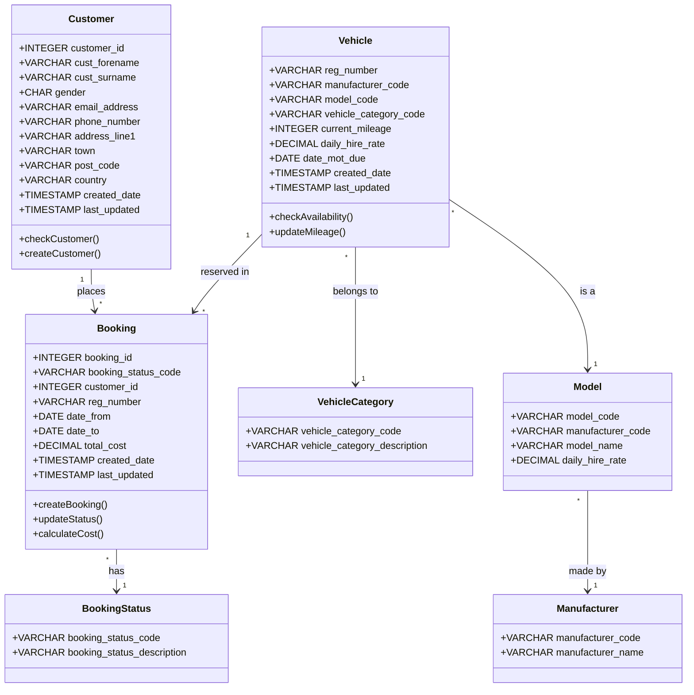

### Entity Relationship Diagram

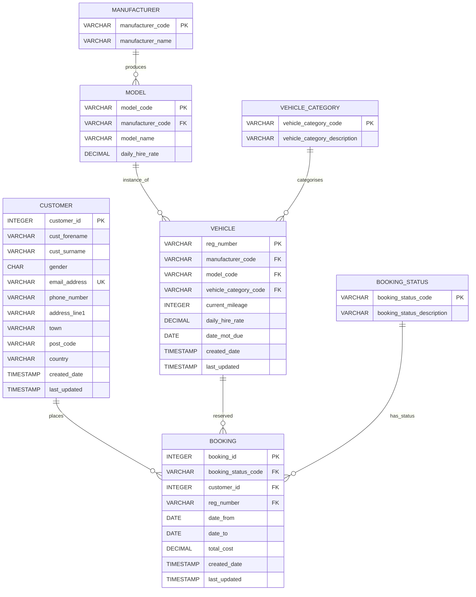

### Data Flow Diagram

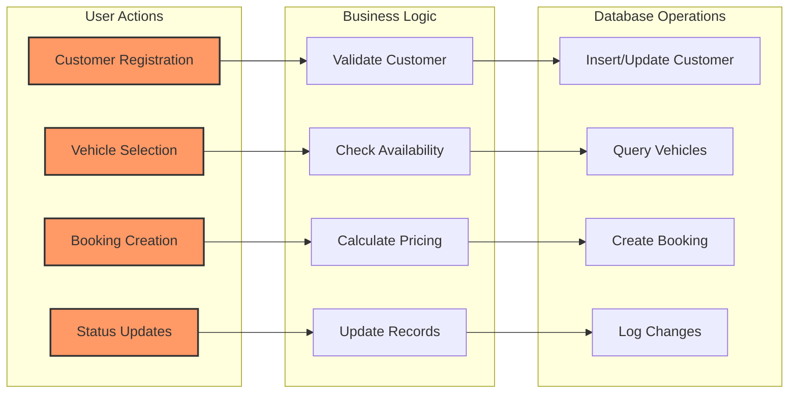

### Deployment Architecture

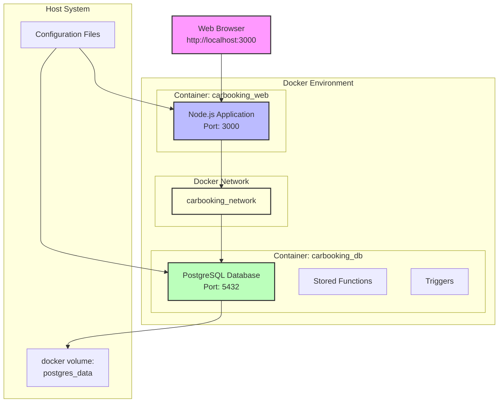

### Sequence Diagram: Booking Process

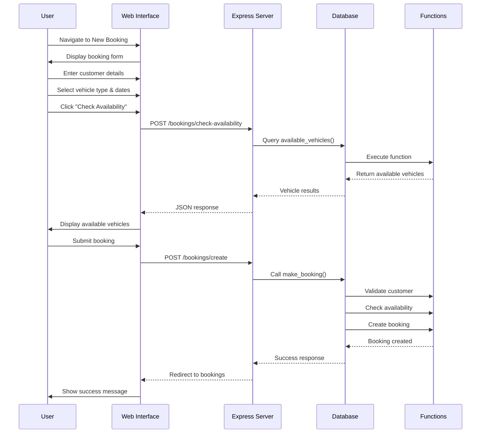

## Installation

### Prerequisites
- Docker and Docker Compose (recommended)
- OR PostgreSQL 13+ and Node.js 16+

### Quick Start with Docker

1. Clone the repository:
```bash
git clone https://github.com/AL-Kaisi/CarBookingSystem.git
cd CarBookingSystem
```

2. Start the complete system:
```bash
docker-compose up -d
```

3. Access the web interface:
```
http://localhost:3000
```

That's it! The system is now running with both database and web interface.

### Manual Installation

#### Database Setup

1. Create database:
```bash
createdb carbooking
```

2. Install schema:
```bash
psql -d carbooking -f scripts/install-complete.sql
```

3. Load sample data (optional):
```bash
psql -d carbooking -f sql/data/sample_data.sql
```

#### Web Interface Setup

1. Install dependencies:
```bash
cd web
npm install
```

2. Configure environment:
```bash
cp .env.example .env
# Edit .env with your database credentials
```

3. Start the server:
```bash
npm start
```

## Usage

### Web Interface Features

#### Dashboard
- View system statistics
- Monitor recent bookings
- Quick access to common actions

#### Customer Management
- Add new customers
- Search existing customers
- View booking history
- Update customer details

#### Vehicle Management
- Add vehicles to fleet
- Update vehicle information
- Check MOT dates
- Monitor mileage

#### Booking System
- Create new bookings
- Check availability in real-time
- Modify existing bookings
- Update booking status

#### Reporting
- Monthly revenue reports
- Visual charts and graphs
- Export data to CSV

### Database Operations

Connect to the database:
```bash
docker exec -it carbooking_db psql -U carbooking -d carbooking
```

Example queries:
```sql
-- Check available vehicles
SELECT * FROM available_vehicles('SUV', '2025-07-01', '2025-07-05');

-- Create a booking
SELECT make_booking(
    NULL, 'John', 'Smith', 'M',
    'john.smith@example.co.uk', '020-7946-0123',
    '123 High Street', NULL, NULL,
    'London', 'SW1A 1AA', 'UK',
    'SUV', '2025-07-01'::DATE, '2025-07-05'::DATE,
    'confirmed'
);

-- Generate revenue report
SELECT * FROM revenue_report();
```

## API Documentation

### Endpoints

| Method | Endpoint | Description |
|--------|----------|-------------|
| GET | `/` | Dashboard |
| GET | `/customers` | List customers |
| POST | `/customers/create` | Create customer |
| GET | `/vehicles` | List vehicles |
| POST | `/vehicles/create` | Add vehicle |
| GET | `/bookings` | List bookings |
| POST | `/bookings/create` | Create booking |
| GET | `/reports` | View reports |

### Database Functions

| Function | Description |
|----------|-------------|
| `customer_check()` | Verify customer existence |
| `create_customer()` | Register new customer |
| `check_cars()` | Check vehicle availability |
| `make_booking()` | Create complete booking |
| `update_booking()` | Modify booking status |
| `available_vehicles()` | List available vehicles |
| `revenue_report()` | Generate revenue report |

## Technology Stack

### Backend
- **Database**: PostgreSQL 13+
- **Language**: PL/pgSQL for stored procedures
- **Server**: Node.js with Express
- **ORM**: Native PostgreSQL driver

### Frontend
- **Templating**: EJS
- **Styling**: Custom CSS
- **JavaScript**: Vanilla JS
- **Charts**: Chart.js

### Infrastructure
- **Containerisation**: Docker
- **Orchestration**: Docker Compose
- **Environment**: Cross-platform compatible

## Project Structure

```
CarBookingSystem/
├── docker-compose.yml    # Docker orchestration
├── web/                  # Node.js web application
│   ├── src/             # Server code
│   ├── controllers/     # Request handlers
│   ├── routes/          # URL routing
│   ├── views/           # EJS templates
│   └── public/          # Static assets
├── sql/                  # Database code
│   ├── functions/       # Stored procedures
│   ├── triggers/        # Database triggers
│   └── data/           # Sample data
├── scripts/             # Installation scripts
│   ├── install.sql     # Base schema
│   └── install-complete.sql  # Full installation
├── tests/               # Test suites
└── docs/               # Documentation
    ├── api/            # API docs
    ├── schemas/        # Database design
    └── guides/         # User guides
```

## Contributing

We welcome contributions! Please see our [Contributing Guidelines](CONTRIBUTING.md) for details.

### Development Workflow

1. Fork the repository
2. Create a feature branch
3. Make your changes
4. Add tests
5. Submit a pull request

### Code Standards

- Use British English in documentation
- Follow SQL formatting conventions
- Maintain consistent code style
- Include appropriate comments

## Support

- **Documentation**: [Full Docs](docs/)
- **Issues**: [GitHub Issues](https://github.com/AL-Kaisi/CarBookingSystem/issues)
- **Discussions**: [GitHub Discussions](https://github.com/AL-Kaisi/CarBookingSystem/discussions)

## Licence

This project is licenced under the MIT Licence - see the [LICENCE](LICENCE) file for details.

## Authors

- **Mohamed Alkaisi** - *Initial work* - [GitHub](https://github.com/AL-Kaisi)

## Acknowledgements

- PostgreSQL community
- Node.js community
- All contributors and testers

---

Made with dedication by the Car Booking System team