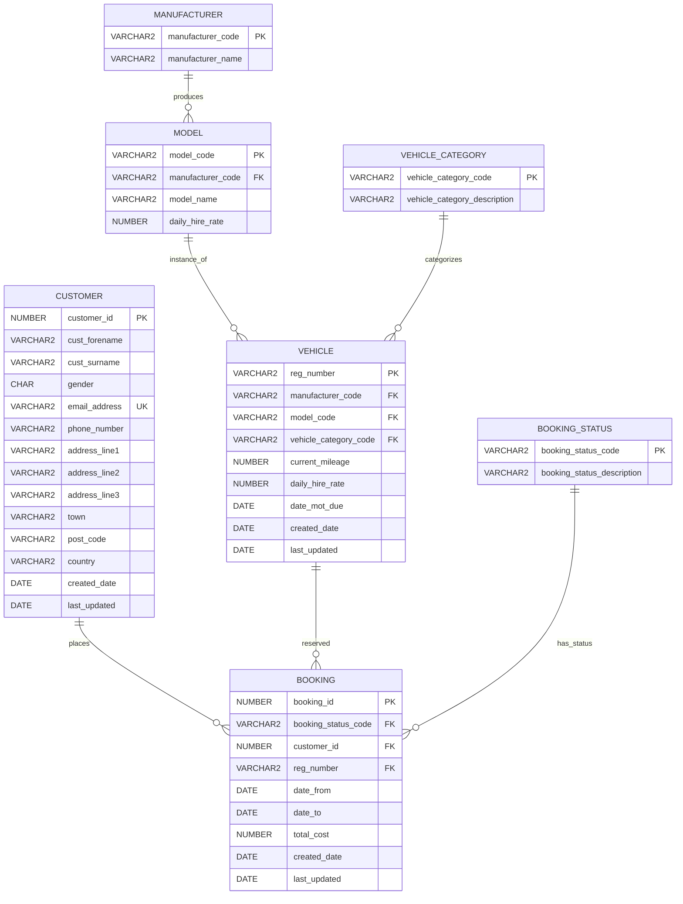

# Database Schema Documentation

## Overview

The Car Booking System uses a normalized relational database design with the following key entities:
- Customers
- Vehicles
- Bookings
- Manufacturers
- Models
- Categories

## Entity Relationship Diagram



## Tables

### CUSTOMER
Stores customer information.

| Column | Type | Constraints | Description |
|--------|------|-------------|-------------|
| customer_id | NUMBER | PRIMARY KEY | Unique customer identifier |
| cust_forename | VARCHAR2(50) | NOT NULL | Customer's first name |
| cust_surname | VARCHAR2(50) | NOT NULL | Customer's last name |
| gender | CHAR(1) | CHECK (M,F) | Customer's gender |
| email_address | VARCHAR2(100) | UNIQUE, NOT NULL | Customer's email |
| phone_number | VARCHAR2(20) | | Contact number |
| address_line1 | VARCHAR2(100) | | Primary address |
| address_line2 | VARCHAR2(100) | | Secondary address |
| address_line3 | VARCHAR2(100) | | Additional address |
| town | VARCHAR2(50) | | City/Town |
| post_code | VARCHAR2(20) | | Postal code |
| country | VARCHAR2(50) | | Country |
| created_date | DATE | DEFAULT SYSDATE | Record creation date |
| last_updated | DATE | DEFAULT SYSDATE | Last modification date |

### VEHICLE
Contains vehicle inventory information.

| Column | Type | Constraints | Description |
|--------|------|-------------|-------------|
| reg_number | VARCHAR2(20) | PRIMARY KEY | Registration number |
| manufacturer_code | VARCHAR2(20) | FOREIGN KEY | Links to MANUFACTURER |
| model_code | VARCHAR2(20) | FOREIGN KEY | Links to MODEL |
| vehicle_category_code | VARCHAR2(20) | FOREIGN KEY | Links to VEHICLE_CATEGORY |
| current_mileage | NUMBER(10) | | Current odometer reading |
| daily_hire_rate | NUMBER(10,2) | | Daily rental cost |
| date_mot_due | DATE | | MOT due date |
| created_date | DATE | DEFAULT SYSDATE | Record creation date |
| last_updated | DATE | DEFAULT SYSDATE | Last modification date |

### BOOKING
Tracks all booking transactions.

| Column | Type | Constraints | Description |
|--------|------|-------------|-------------|
| booking_id | NUMBER | PRIMARY KEY | Unique booking identifier |
| booking_status_code | VARCHAR2(20) | FOREIGN KEY | Links to BOOKING_STATUS |
| customer_id | NUMBER | FOREIGN KEY | Links to CUSTOMER |
| reg_number | VARCHAR2(20) | FOREIGN KEY | Links to VEHICLE |
| date_from | DATE | NOT NULL | Booking start date |
| date_to | DATE | NOT NULL | Booking end date |
| total_cost | NUMBER(10,2) | | Total booking cost |
| created_date | DATE | DEFAULT SYSDATE | Record creation date |
| last_updated | DATE | DEFAULT SYSDATE | Last modification date |

**Constraints:**
- CHECK (date_to >= date_from)

### MANUFACTURER
Reference table for vehicle manufacturers.

| Column | Type | Constraints | Description |
|--------|------|-------------|-------------|
| manufacturer_code | VARCHAR2(20) | PRIMARY KEY | Unique manufacturer code |
| manufacturer_name | VARCHAR2(50) | NOT NULL | Manufacturer name |

### MODEL
Vehicle model reference data.

| Column | Type | Constraints | Description |
|--------|------|-------------|-------------|
| model_code | VARCHAR2(20) | PRIMARY KEY | Unique model code |
| manufacturer_code | VARCHAR2(20) | FOREIGN KEY | Links to MANUFACTURER |
| model_name | VARCHAR2(50) | NOT NULL | Model name |
| daily_hire_rate | NUMBER(10,2) | NOT NULL | Standard daily rate |

### VEHICLE_CATEGORY
Vehicle categorization reference.

| Column | Type | Constraints | Description |
|--------|------|-------------|-------------|
| vehicle_category_code | VARCHAR2(20) | PRIMARY KEY | Category code |
| vehicle_category_description | VARCHAR2(100) | NOT NULL | Category description |

### BOOKING_STATUS
Booking status reference table.

| Column | Type | Constraints | Description |
|--------|------|-------------|-------------|
| booking_status_code | VARCHAR2(20) | PRIMARY KEY | Status code |
| booking_status_description | VARCHAR2(100) | NOT NULL | Status description |

## Sequences

| Sequence Name | Start Value | Increment | Description |
|--------------|-------------|-----------|-------------|
| CUST_ID_SEQ | 1000 | 1 | Customer ID generator |
| BOOK_ID_SEQ | 5000 | 1 | Booking ID generator |
| VEHICLE_ID_SEQ | 100 | 1 | Vehicle ID generator |

## Indexes

### Performance Indexes
- `idx_customer_email` on CUSTOMER(email_address)
- `idx_customer_name` on CUSTOMER(cust_surname, cust_forename)
- `idx_booking_dates` on BOOKING(date_from, date_to)
- `idx_booking_customer` on BOOKING(customer_id)
- `idx_booking_vehicle` on BOOKING(reg_number)
- `idx_vehicle_category` on VEHICLE(vehicle_category_code)

## Views

### CUSTOMER_BOOKING
Provides a comprehensive view of bookings with customer and vehicle details.

```sql
CREATE VIEW customer_booking AS
SELECT 
    b.booking_id,
    b.customer_id,
    b.booking_status_code,
    b.reg_number,
    b.date_from,
    b.date_to,
    c.cust_forename,
    c.cust_surname,
    c.email_address,
    v.manufacturer_code,
    v.model_code,
    v.vehicle_category_code,
    v.daily_hire_rate
FROM booking b
JOIN customer c ON b.customer_id = c.customer_id
JOIN vehicle v ON b.reg_number = v.reg_number;
```

## Triggers

### UPDATING_BOOKING_STATUS
Prevents modification of cancelled bookings.

```sql
CREATE TRIGGER updating_booking_status
BEFORE UPDATE ON BOOKING
FOR EACH ROW
BEGIN 
    IF :OLD.BOOKING_STATUS_CODE = 'cancelled' THEN
        RAISE_APPLICATION_ERROR(-20503, 'Sorry, booking cannot be changed after canceling');
    END IF;
END;
```

## Data Integrity

### Referential Integrity
- All foreign keys are enforced
- Cascading deletes are not used to preserve historical data

### Business Rules
1. Booking dates must be valid (end date >= start date)
2. Cancelled bookings cannot be modified
3. Email addresses must be unique
4. Gender must be 'M' or 'F'

### Standard Values

#### Vehicle Categories
- COMPACT: Compact Car
- SEDAN: Sedan
- SUV: Sport Utility Vehicle
- LUXURY: Luxury Vehicle
- VAN: Van
- TRUCK: Pickup Truck

#### Booking Statuses
- open: Open - Unconfirmed
- confirmed: Confirmed
- cancelled: Cancelled
- completed: Completed
- no_show: No Show

## Performance Considerations

1. **Indexing Strategy**: All foreign keys and commonly queried columns are indexed
2. **Partitioning**: Consider partitioning BOOKING table by date_from for large datasets
3. **Archiving**: Implement archiving strategy for old bookings
4. **Statistics**: Regular statistics gathering for optimal query performance

## Security Considerations

1. **Access Control**: Implement appropriate grants for different user roles
2. **Audit Trail**: Consider adding audit columns for sensitive operations
3. **Data Encryption**: Encrypt sensitive customer information
4. **Input Validation**: All inputs validated through PL/SQL packages